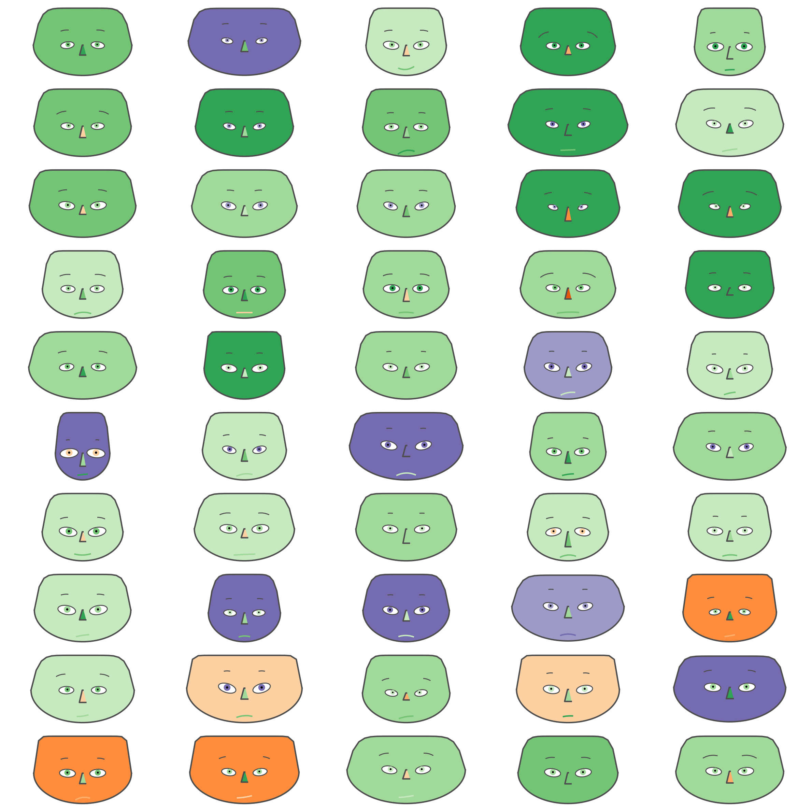
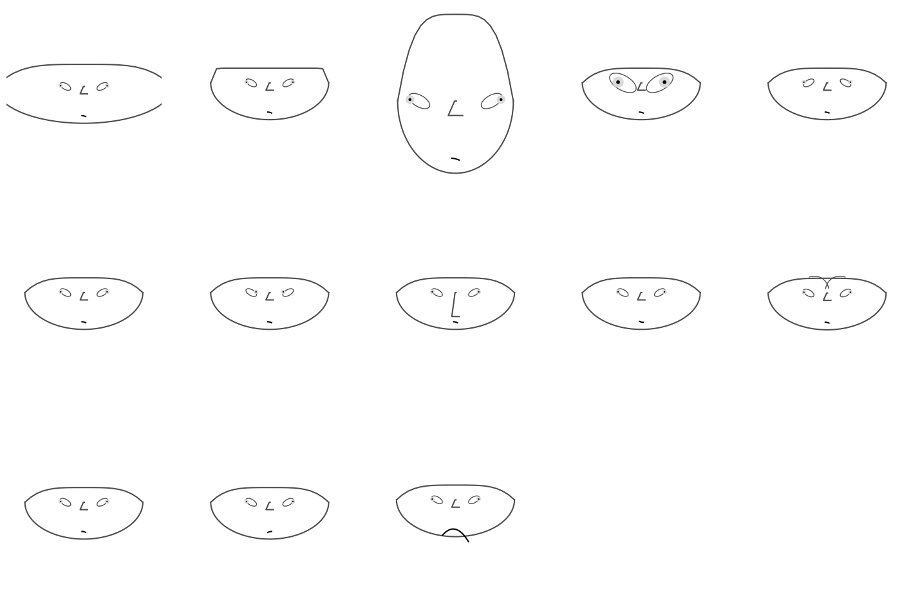
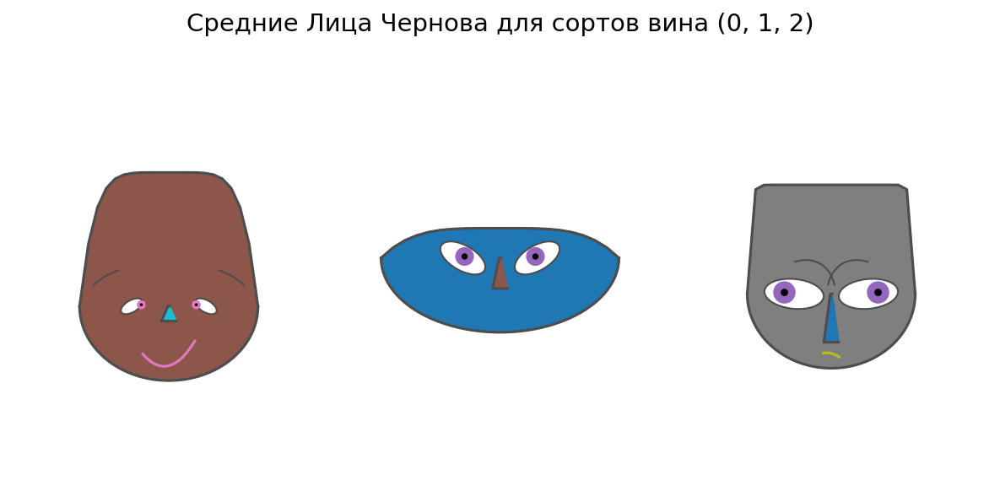
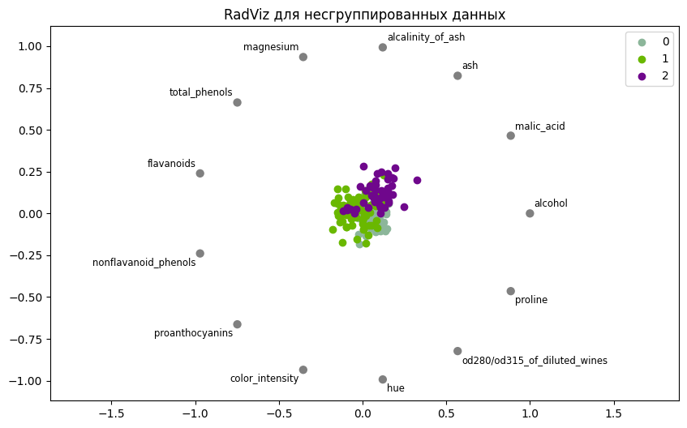
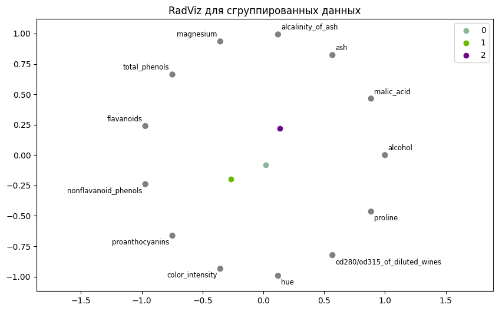
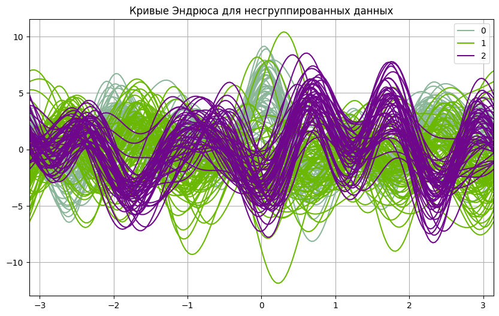
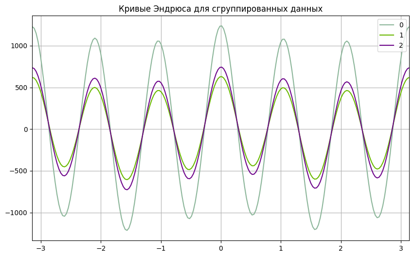

# MultivariateViz_Matplotlib  

Визуализация многомерных данных с использованием специализированных методов.  
Проект выполнен в рамках лабораторной работы по анализу и визуализации данных. 

---

## 📌 Описание проекта  
Для демонстрации многомерной визуализации используется **датасет о винах** (`sklearn.datasets.load_wine`).  
Цель — изучить разные подходы к отображению многомерных данных и их интерпретацию.  

Реализованы следующие методы:  
- 👤 **Лица Чернова** (Chernoff Faces) — отображение признаков через черты лица.  
- 📊 **Параллельные координаты** — сравнение объектов по множеству признаков.  
- 🌐 **RadViz** — проекция многомерных данных в двумерное пространство.  
- 📈 **Кривые Эндрюса** — представление объектов в виде функций.  

Для каждого метода показаны:  
- Несгруппированные данные (все образцы).  
- Сгруппированные данные (усреднённые значения по сортам вина).  

---

## 🛠 Используемые библиотеки  
- `pandas`, `numpy` — обработка данных  
- `matplotlib`, `plotly` — визуализация  
- `sklearn.datasets` — загрузка wine dataset  
- `ChernoffFace` — построение лиц Чернова

---

## 🖼 Screenshots / Скриншоты

*Рис. 1 — Построение лиц Чернова (для некоторых вин)*

*Рис. 2 — Построение лиц Чернова (для каждого параметра)*

*Рис. 3 — Построение лиц Чернова (средние по сортам)*

 
*Рис. 4 — RadViz для несгруппированных*

*Рис. 5 — RadViz для сгруппированных* 

*Рис. 6 — Кривые Эндрюса для несгруппированных* 

*Рис. 7 — Кривые Эндрюса для сгруппированных* 
